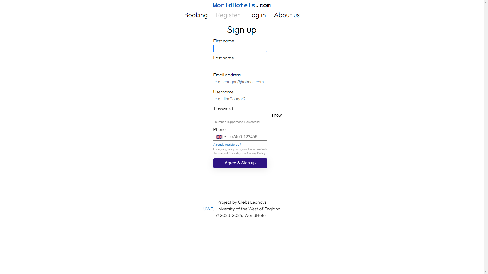
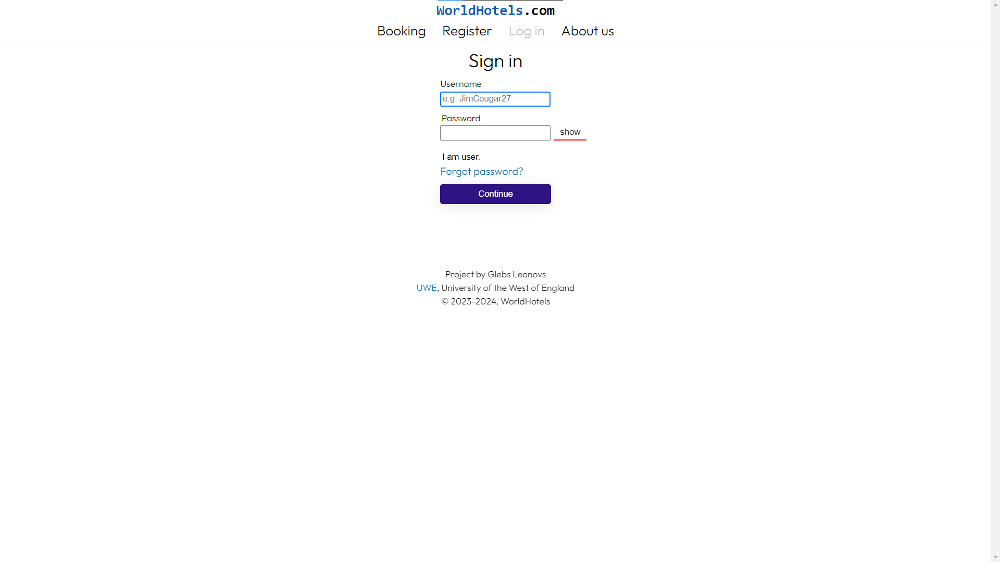
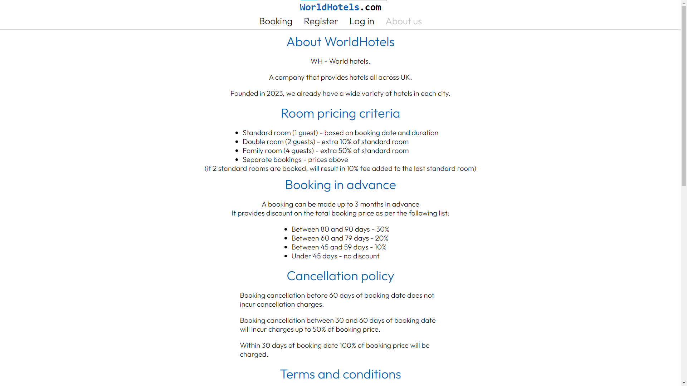
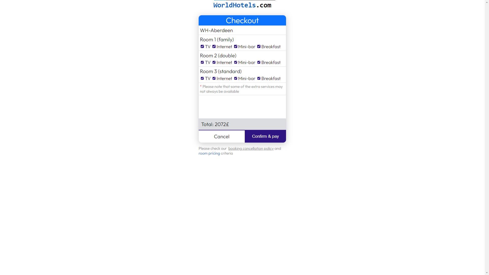
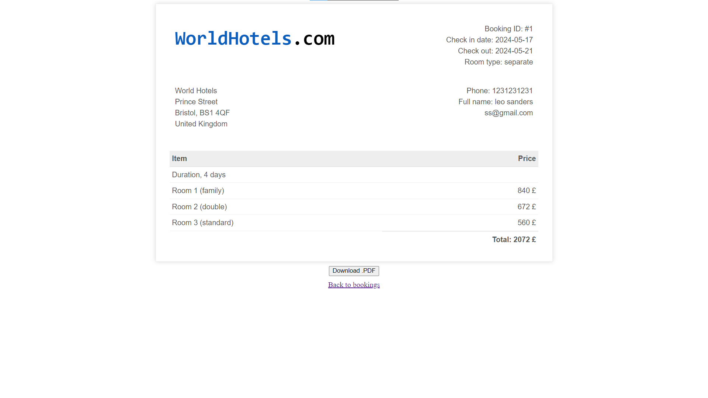
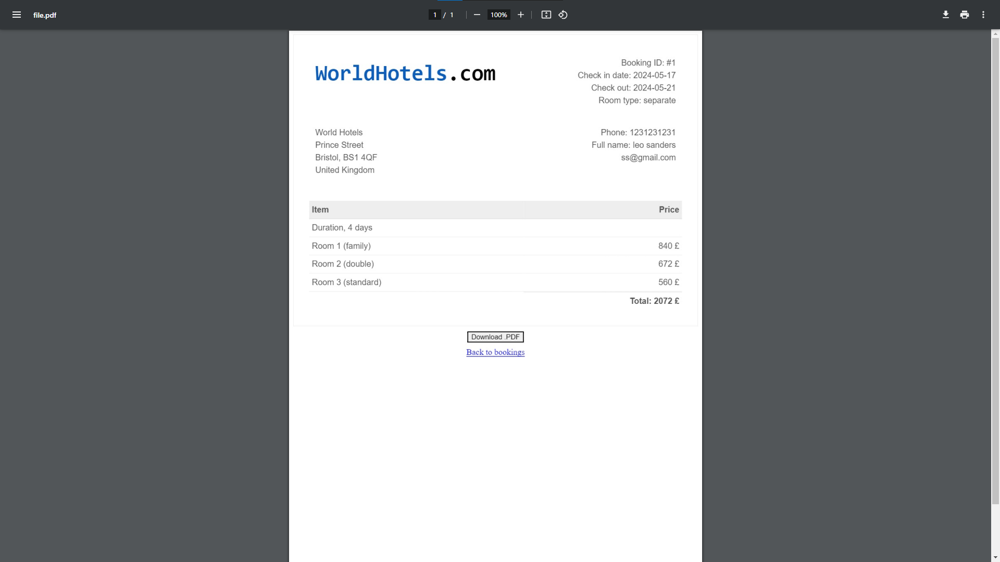
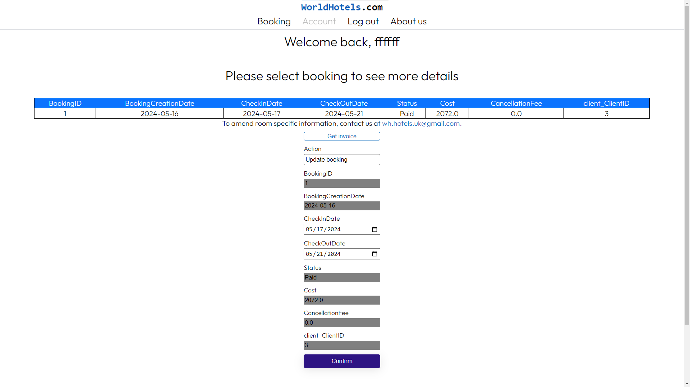
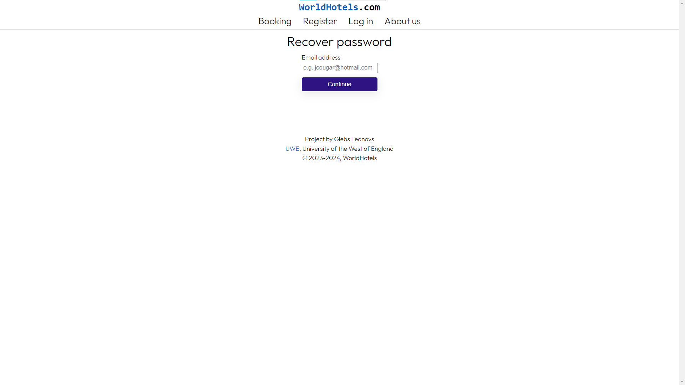

# REQUIRED VARIABLES
main.py, DatabaseHandler.py
[SECRET_KEY]
app.secret_key = SECRET_KEY

main.py [MAIL, MAIL_PASSWORD]
uses gmail message sending api
app.config['MAIL_USERNAME'] = 'MAIL'
app.config['MAIL_PASSWORD'] = 'MAIL_PASSWORD'

DatabaseHandler.py [DB_USER, DB_PASS, DB_NAME]
self.data_modifier = DatabaseControl(host='localhost', user='DB_USER', password='DB_PASS',
                                     database='DB_NAME')

[EXAMPLE PDF](README/1.pdf)

